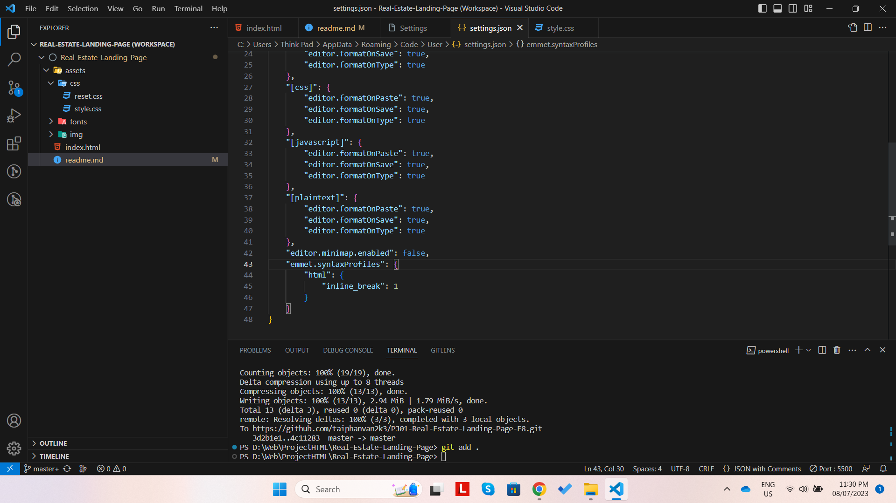

- Bắt đầu 1 dự án thì phải có phần dựng base
- Dùng đường dẫn tương đối luôn để luôn đúng khi mở bằng trình duyệt hoặc chạy bằn Live server
- Khi tải font về thì nên convert font ra font-web: https://transfonter.org/ 
Đặt tất cả file font vào thư mục tương ứng: vd /fonts/Poppins. Copy tất cả `@font-face` trong file stylesheet.css được tạo ra bỏ vào file styleshee.css trong fonts/stylesheet.css
- Cấu hình VS code để inline tag in new line (keyword: `vs code emmet inline new line`)
```json
"emmet.syntaxProfiles": {
    "html": {
        "inline_break": 1
    }
}
```
+ Vì cái này cần thiết nên config trên `User` luôn
