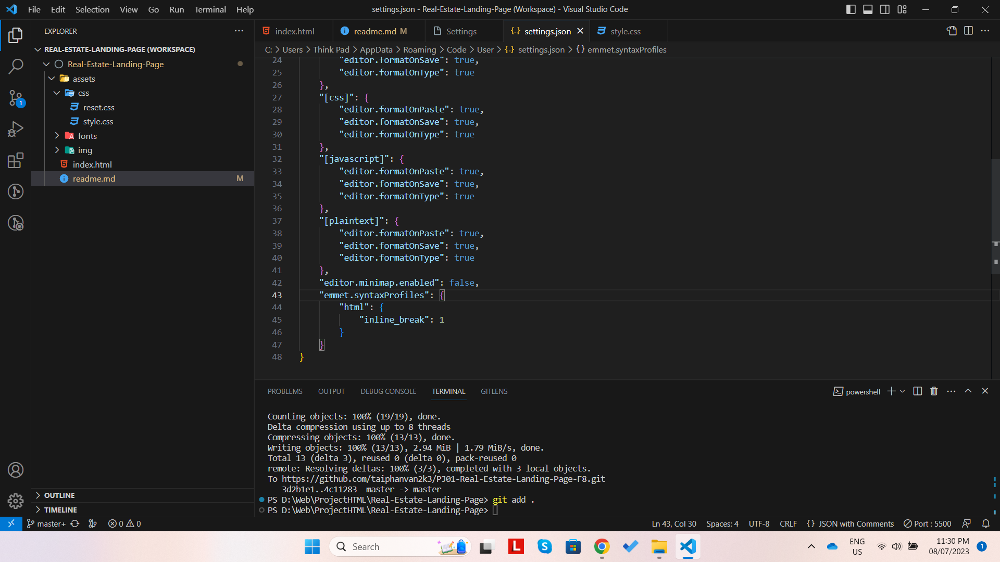
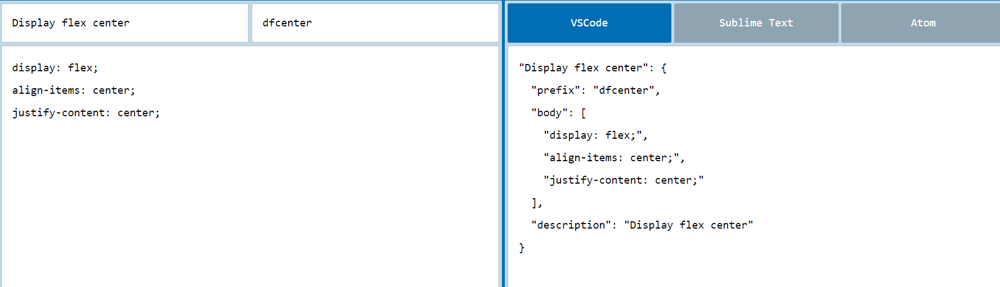

- Bắt đầu 1 dự án thì phải có phần dựng base
- Dùng đường dẫn tương đối luôn để luôn đúng khi mở bằng trình duyệt hoặc chạy bằn Live server
- Khi tải font về thì nên convert font ra font-web: https://transfonter.org/ 
Đặt tất cả file font vào thư mục tương ứng: vd /fonts/Poppins. Copy tất cả `@font-face` trong file stylesheet.css được tạo ra bỏ vào file styleshee.css trong fonts/stylesheet.css
- Cấu hình VS code để inline tag in new line (keyword: `vs code emmet inline new line`)
```json
"emmet.syntaxProfiles": {
    "html": {
        "inline_break": 1
    }
}
```
+ Vì cái này cần thiết nên config trên `User` luôn


# Custom snippet code:

- Tình huống 1: khi sử dụng emmet cliptext thì nó sẽ sinh ra đoạn code trong body, đồng thời con trỏ chuột sẽ nằm ở vị trí $1 và đã điền sẵn giá trị là 2. Nếu muốn thay đổi thì thay đổi rồi tab
```json
"Clip text": {
    "prefix": "cliptext",
    "body": [
        "display: -webkit-box;",
        "-webkit-line-clamp: var(--line-clamp, ${1:2});",
        "-webkit-box-orient: vertical;",
        "overflow: hidden;"
    ],
    "description": "Clip text"
}
```
- Tình huống 2: nếu dùng dfcenter và không muốn điền trước 2 giá trị, sẽ điền lần lượt, điền xong thì nhấn tab để qua giá trị thứ hai
```json
"Display flex center": {
    "prefix": "dfcenter",
    "body": [
        "display: flex;",
        "align-items: $1;",
        "justify-content: $2;"
    ],
    "description": "Display flex center"
}
```
- Tình huống 3: chưa điền giá trị và khi điền 1 nơi thì nơi có cùng $ sẽ được điền theo
```json
"Display flex center": {
    "prefix": "dfcenter",
    "body": [
        "display: flex;",
        "align-items: $1;",
        "justify-content: $1;"
    ],
    "description": "Display flex center"
}
```
